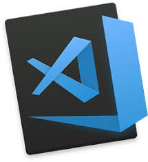

<!--HEADING-->

# My title h1
## My title h2
### My title h3
#### My title h4
##### My title h5
###### My title h6
<!--Italic text-->
this is an *italic* text
<!--String text-->
this is an **strong** text
<!--strikethrough-->
Este es un texto ~~tachado~~

<!--UL-->
* apple
    * apple 2
* orange
* grapes

1. Tomato
    1. Fer
2. Onion
3. Potato

[faztweb.com](https://www.faztweb.com)

[faztweb.com](https://www.faztweb.com "Este es un link")

> this is a qoute

---
___

`console.log('hello world)`

```javascript
    const mongoose = require('mongose);
    mongoose.set('useFindAndModify',false);
    mongoose.connect()
```

```html
<h1>Hello world</h1>
```

|Tables    |Are          |Cool        |
|----------|:-----------:|-----------:|
| col 3 is |right-aligned|$1600       | 
| Fer      |Vera         |Fer         |

|Name       |Last name  |
|-----------|-----------|
|Abril      |Palacios   |




<!--GITHUN MARKDOWN-->
<!--Check-->
* [X] Task 1
* [X] Task 2
* [ ] Task 1
* [ ] Task 3

@EveFer :smiley: :+1:


